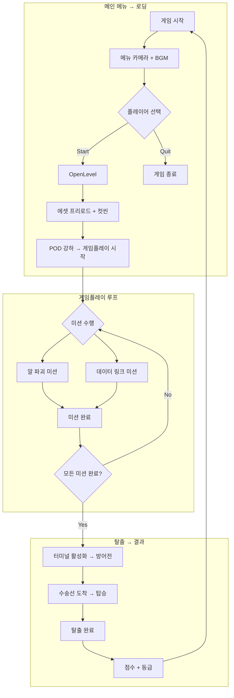
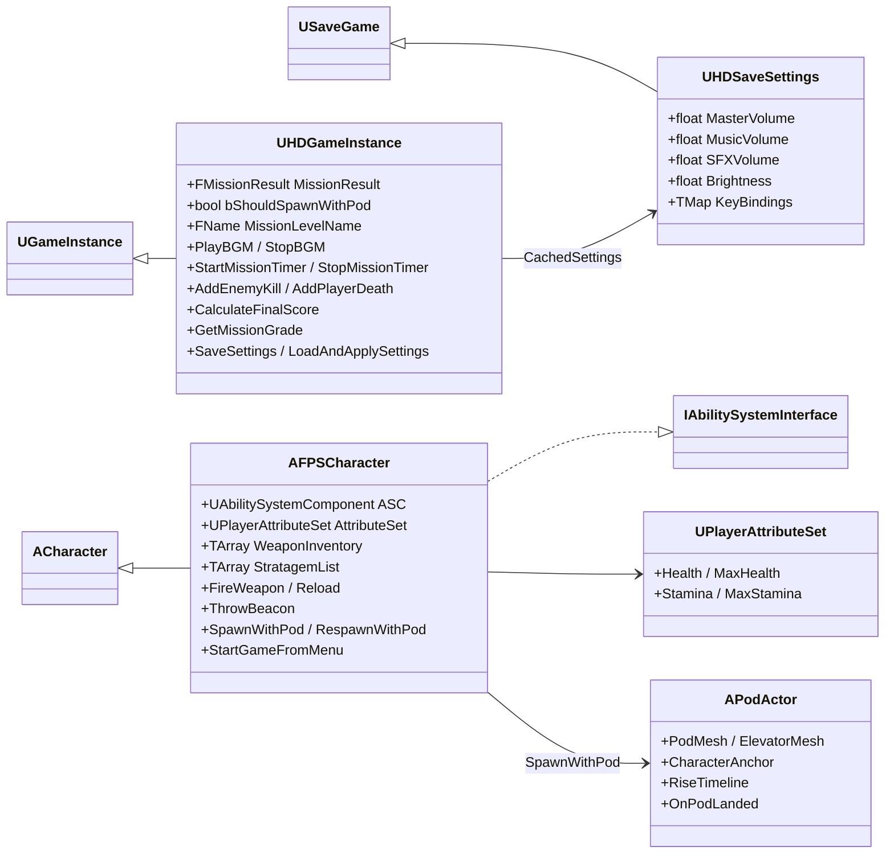
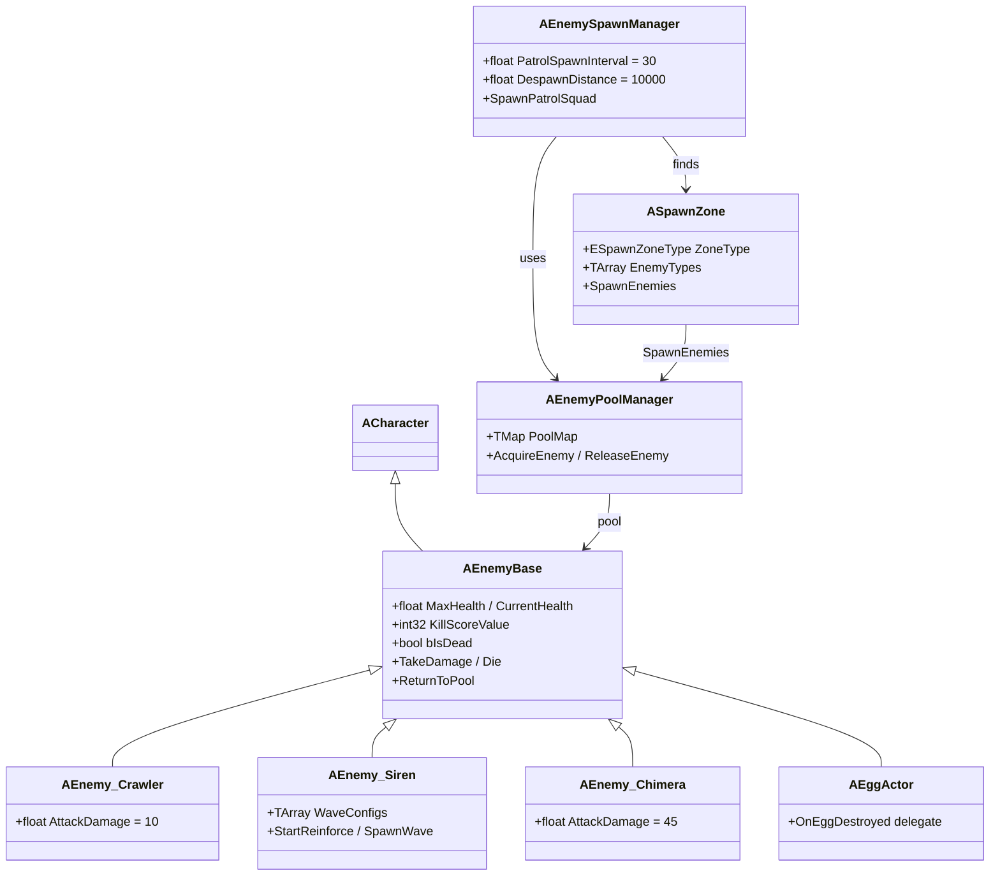
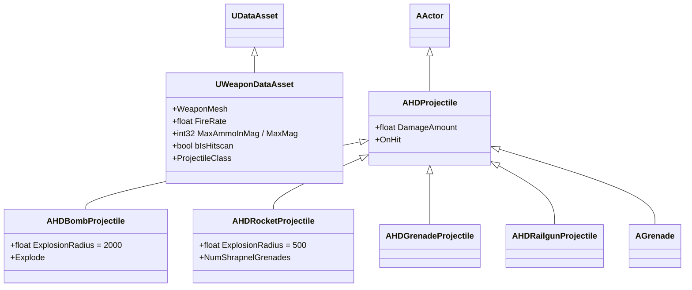
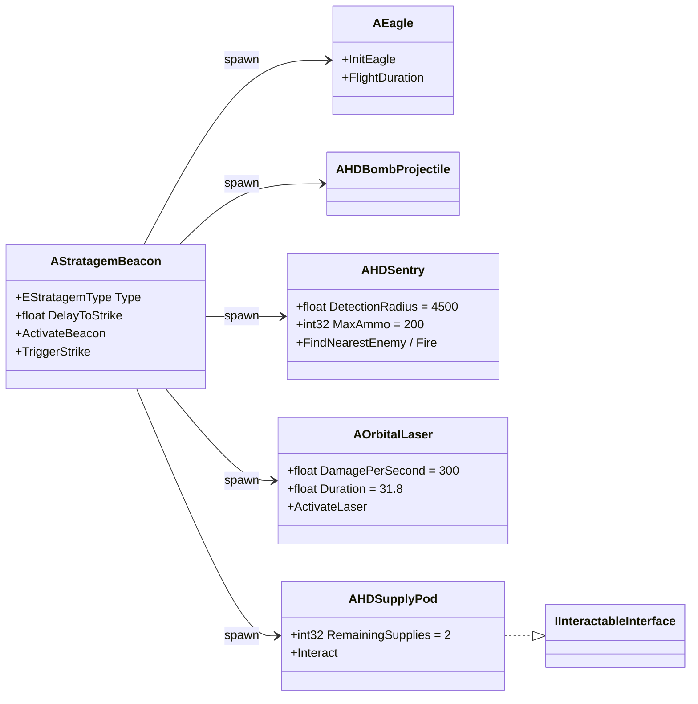
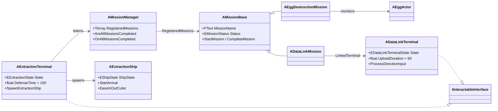
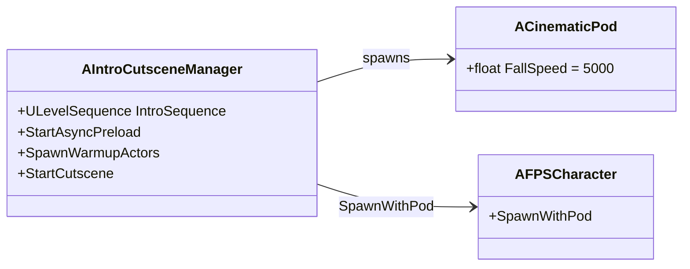

# ProjectHD Diagrams

## Game Flow Chart

```mermaid
flowchart TD
    subgraph Start["메인 메뉴 → 로딩"]
        A[게임 시작] --> B[메뉴 카메라 + BGM]
        B --> D{플레이어 선택}
        D -->|Start| G[OpenLevel]
        D -->|Quit| QUIT[게임 종료]
        G --> J[에셋 프리로드 + 컷씬]
        J --> O[POD 강하 → 게임플레이 시작]
    end

    subgraph Gameplay["게임플레이 루프"]
        O --> X{미션 수행}
        X --> X1[알 파괴 미션]
        X --> X2[데이터 링크 미션]
        X1 --> Y[미션 완료]
        X2 --> Y
        Y --> Z{모든 미션 완료?}
        Z -->|No| X
    end

    subgraph Ending["탈출 → 결과"]
        Z -->|Yes| EA[터미널 활성화 → 방어전]
        EA --> EF[수송선 도착 → 탑승]
        EF --> EL[탈출 완료]
        EL --> RC[점수 + 등급]
        RC --> A
    end
```

## Class Diagrams

### Core & Player

```mermaid
classDiagram
    direction LR

    UGameInstance <|-- UHDGameInstance
    USaveGame <|-- UHDSaveSettings
    UHDGameInstance --> UHDSaveSettings : CachedSettings

    class UHDGameInstance {
        +FMissionResult MissionResult
        +bool bShouldSpawnWithPod
        +FName MissionLevelName
        +PlayBGM / StopBGM
        +StartMissionTimer / StopMissionTimer
        +AddEnemyKill / AddPlayerDeath
        +CalculateFinalScore
        +GetMissionGrade
        +SaveSettings / LoadAndApplySettings
    }

    class UHDSaveSettings {
        +float MasterVolume
        +float MusicVolume
        +float SFXVolume
        +float Brightness
        +TMap KeyBindings
    }

    ACharacter <|-- AFPSCharacter
    AFPSCharacter ..|> IAbilitySystemInterface
    AFPSCharacter --> UPlayerAttributeSet
    AFPSCharacter --> APodActor : SpawnWithPod

    class AFPSCharacter {
        +UAbilitySystemComponent ASC
        +UPlayerAttributeSet AttributeSet
        +TArray WeaponInventory
        +TArray StratagemList
        +FireWeapon / Reload
        +ThrowBeacon
        +SpawnWithPod / RespawnWithPod
        +StartGameFromMenu
    }

    class UPlayerAttributeSet {
        +Health / MaxHealth
        +Stamina / MaxStamina
    }

    class APodActor {
        +PodMesh / ElevatorMesh
        +CharacterAnchor
        +RiseTimeline
        +OnPodLanded
    }
```

### Enemy & Spawn

```mermaid
classDiagram
    direction TB

    ACharacter <|-- AEnemyBase
    AEnemyBase <|-- AEnemy_Crawler
    AEnemyBase <|-- AEnemy_Siren
    AEnemyBase <|-- AEnemy_Chimera
    AEnemyBase <|-- AEggActor

    class AEnemyBase {
        +float MaxHealth / CurrentHealth
        +int32 KillScoreValue
        +bool bIsDead
        +TakeDamage / Die
        +ReturnToPool
    }

    class AEnemy_Crawler {
        +float AttackDamage = 10
    }

    class AEnemy_Siren {
        +TArray WaveConfigs
        +StartReinforce / SpawnWave
    }

    class AEnemy_Chimera {
        +float AttackDamage = 45
    }

    class AEggActor {
        +OnEggDestroyed delegate
    }

    AEnemySpawnManager --> AEnemyPoolManager : uses
    AEnemySpawnManager --> ASpawnZone : finds
    AEnemyPoolManager --> AEnemyBase : pool
    ASpawnZone --> AEnemyPoolManager : SpawnEnemies

    class AEnemyPoolManager {
        +TMap PoolMap
        +AcquireEnemy / ReleaseEnemy
    }

    class AEnemySpawnManager {
        +float PatrolSpawnInterval = 30
        +float DespawnDistance = 10000
        +SpawnPatrolSquad
    }

    class ASpawnZone {
        +ESpawnZoneType ZoneType
        +TArray EnemyTypes
        +SpawnEnemies
    }
```

### Weapon & Projectile

```mermaid
classDiagram
    direction TB

    UDataAsset <|-- UWeaponDataAsset

    class UWeaponDataAsset {
        +WeaponMesh
        +float FireRate
        +int32 MaxAmmoInMag / MaxMag
        +bool bIsHitscan
        +ProjectileClass
    }

    AActor <|-- AHDProjectile
    AHDProjectile <|-- AHDBombProjectile
    AHDProjectile <|-- AHDRocketProjectile
    AHDProjectile <|-- AHDGrenadeProjectile
    AHDProjectile <|-- AHDRailgunProjectile
    AHDProjectile <|-- AGrenade

    class AHDProjectile {
        +float DamageAmount
        +OnHit
    }

    class AHDBombProjectile {
        +float ExplosionRadius = 2000
        +Explode
    }

    class AHDRocketProjectile {
        +float ExplosionRadius = 500
        +NumShrapnelGrenades
    }
```

### Stratagem

```mermaid
classDiagram
    direction LR

    AStratagemBeacon --> AEagle : spawn
    AStratagemBeacon --> AHDBombProjectile : spawn
    AStratagemBeacon --> AHDSentry : spawn
    AStratagemBeacon --> AOrbitalLaser : spawn
    AStratagemBeacon --> AHDSupplyPod : spawn
    AHDSupplyPod ..|> IInteractableInterface

    class AStratagemBeacon {
        +EStratagemType Type
        +float DelayToStrike
        +ActivateBeacon
        +TriggerStrike
    }

    class AEagle {
        +InitEagle
        +FlightDuration
    }

    class AHDSentry {
        +float DetectionRadius = 4500
        +int32 MaxAmmo = 200
        +FindNearestEnemy / Fire
    }

    class AOrbitalLaser {
        +float DamagePerSecond = 300
        +float Duration = 31.8
        +ActivateLaser
    }

    class AHDSupplyPod {
        +int32 RemainingSupplies = 2
        +Interact
    }
```

### Mission & Extraction

```mermaid
classDiagram
    direction LR

    AMissionBase <|-- AEggDestructionMission
    AMissionBase <|-- ADataLinkMission
    AMissionManager --> AMissionBase : RegisteredMissions
    AEggDestructionMission --> AEggActor : monitors
    ADataLinkMission --> ADataLinkTerminal : LinkedTerminal
    AExtractionTerminal --> AMissionManager : listens
    AExtractionTerminal --> AExtractionShip : spawns
    ADataLinkTerminal ..|> IInteractableInterface
    AExtractionTerminal ..|> IInteractableInterface

    class AMissionManager {
        +TArray RegisteredMissions
        +AreAllMissionsCompleted
        +OnAllMissionsCompleted
    }

    class AMissionBase {
        +FText MissionName
        +EMissionStatus Status
        +StartMission / CompleteMission
    }

    class AExtractionTerminal {
        +EExtractionState State
        +float DefenseTime = 150
        +SpawnExtractionShip
    }

    class AExtractionShip {
        +EShipState ShipState
        +StartArrival
        +EaseInOutCubic
    }

    class ADataLinkTerminal {
        +EDataLinkTerminalState State
        +float UploadDuration = 60
        +ProcessDirectionInput
    }
```

### Cutscene

```mermaid
classDiagram
    direction LR

    AIntroCutsceneManager --> ACinematicPod : spawns
    AIntroCutsceneManager --> AFPSCharacter : SpawnWithPod

    class AIntroCutsceneManager {
        +ULevelSequence IntroSequence
        +StartAsyncPreload
        +SpawnWarmupActors
        +StartCutscene
    }

    class ACinematicPod {
        +float FallSpeed = 5000
    }

    class AFPSCharacter {
        +SpawnWithPod
    }
```
